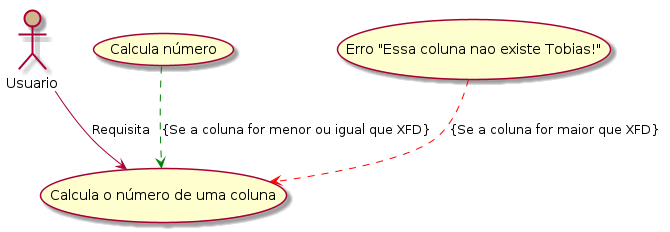

# Entrega

Problema escolhido: https://www.beecrowd.com.br/judge/en/problems/view/3142

## Unified Modeling Language

### Diagram.puml



## Gherkin

```gherkin
@domain
Feature: Translate column letters to number

Narrative:

As an Excel user, I want to translate
column letters to numbers when possible

Scenario Outline: Translate column to number

Given the user enats to send the number of the column by letter
When the Column is <Column>
Then the expected Result is <Result>

Examples:
| Column | Result |
| A | 1 |
| Z | 26 |
| AA | 27 |
| BA | 53 |
| BG | 59 |
| XFD | 16384 |
| XFE | Essa coluna nao existe Tobias! |
```
